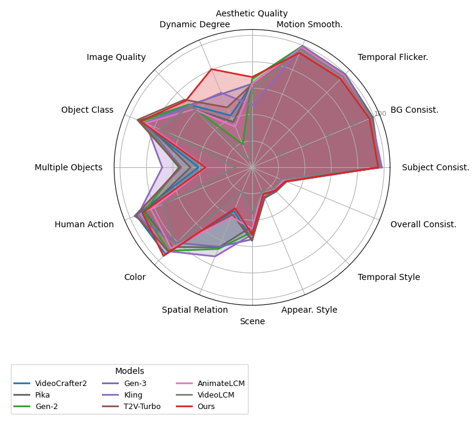
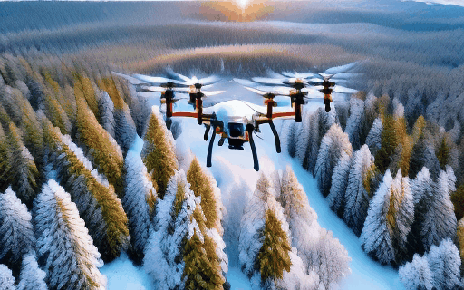

# Advanced text-to-video Diffusion Models


⚡️ This repository provides training recipes for the AMD efficient text-to-video models, which are designed for high performance and efficiency. The training process includes two key steps:

* Distillation and Pruning: We distill and prune the popular text-to-video model [VideoCrafter2](https://github.com/AILab-CVC/VideoCrafter), reducing the parameters to a compact 945M while maintaining competitive performance.

* Optimization with T2V-Turbo: We apply the [T2V-Turbo](https://github.com/Ji4chenLi/t2v-turbo) method on the distilled model to reduce inference steps and further enhance model quality.

This implementation is released to promote further research and innovation in the field of efficient text-to-video generation, optimized for AMD Instinct accelerators.





**8-Steps Results**
| A 3D model of a 1800s victorian house.            | A cute happy Corgi playing in park, sunset, animated style.gif               | A cute raccoon playing guitar in the beach.                 | A cute raccoon playing guitar in the forest.                |
|------------------------|-----------------------------|-----------------------------|-----------------------------|
|   |  |  |  |
|**A quiet beach at dawn and the waves gently lapping.**|**A cute teddy bear, dressed in a red silk outfit, stands in a vibrant street, chinese new year.**|**A sandcastle being eroded by the incoming tide.**|**An astronaut flying in space, in cyberpunk style.**|
|||||
|**A cat DJ at a party.**|**A cute happy Corgi playing in park, sunset, pixel.**|**A drone flying over a snowy forest.**|**A ghost ship navigating through a sea under a moon.**|
|||||

# Checkpoint
Our pretrained checkpoint can be downloaded from [](https://huggingface.co/amd/AMD-Hummingbird-T2V/tree/main)

# Installation
```
pip install -r requirements.txt

pip install flash-attn --no-build-isolation
git clone https://github.com/Dao-AILab/flash-attention.git
cd flash-attention
pip install csrc/fused_dense_lib csrc/layer_norm

conda install xformers -c xformers
```
# Data Processing

## VQA
```
cd data_pre_process/DOVER
sh run.sh
```
Then you can get a score table for all video qualities, sort according to the table, and remove low-scoring videos.
## Remove Dolly Zoom Videos
```
cd data_pre_process/VBench
sh run.sh 
```
According to the motion smoothness score csv file, you can  remove low-scoring videos.
# Training

## Model Distillation

```
sh configs/training_512_t2v_v1.0/run_distill.sh
```


## Acceleration Training

```
cd acceleration/t2v-turbo

# for 0.7 B model
sh train_07B.sh

# for 0.9 B model
sh train_09B.sh
```


# Inference

```
# for 0.7B model
python inference_command_config_07B.py

# for 0.9B model
python inference_command_config_09B.py
```

# License
Copyright (c) 2024 Advanced Micro Devices, Inc. All Rights Reserved.