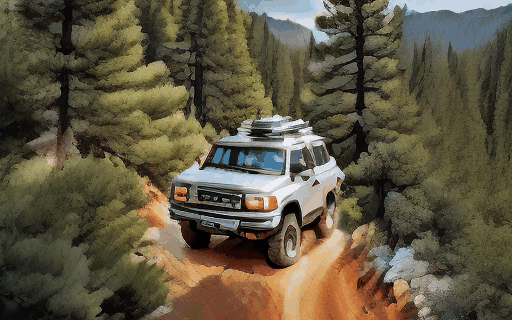
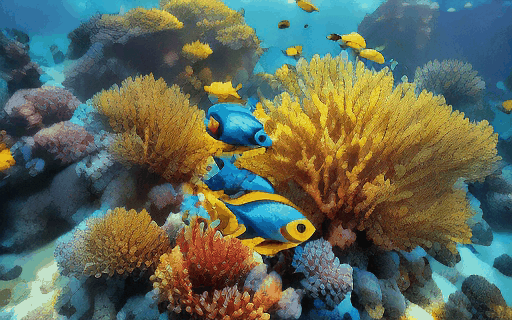
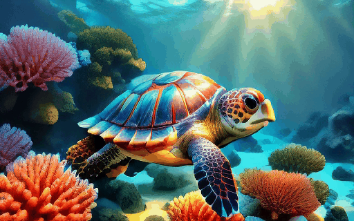

# Advanced text-to-video Diffusion Models


⚡️ This repository provides training recipes for the AMD efficient text-to-video models, which are designed for high performance and efficiency. The training process includes two key steps:

* Distillation and Pruning: We distill and prune the popular text-to-video model [VideoCrafter2](https://github.com/AILab-CVC/VideoCrafter), reducing the parameters to a compact 945M while maintaining competitive performance.

* Optimization with T2V-Turbo: We apply the [T2V-Turbo](https://github.com/Ji4chenLi/t2v-turbo) method on the distilled model to reduce inference steps and further enhance model quality.

This implementation is released to promote further research and innovation in the field of efficient text-to-video generation, optimized for AMD Instinct accelerators.

Compared to Videocrafter2 we achieved better visual quality and 96% latency reduction.

| Diffusion Model         | Params. | Inference Latency on AMD Instinct MI250 fp16 | Aesthetic Quality | Motion Smoothness | Imaging Quality | Temporal Flickering | Background Consistency |
|--------------------------|---------|----------------------------------------------|-------------------|-------------------|------------------|---------------------|-------------------------|
| VideoCrafter2(50 steps, CFG=7.5)          | 1.4B    | 56s                                         | 63.8              | 96.2              | 67.3             | 93.6                | 96.9                    |
| AMD efficient T2V model(4 steps)          | 945M    | 2.2s                                        | 67.9              | 96.8              | 71.6             | 95.4                | 97.6                    |

**4-Steps Results**
| The camera follows behind a white vintage SUV with a black roof rack as it speeds up a steep dirt road surrounded by pine trees on a steep mountain slope.            | Waves crashing against a lone lighthouse, ominous lighting.               | A vibrant underwater scene. A group of blue fish, with yellow fins, are swimming around a coral reef.                | A young man in his twenties sat on a cloud in the sky and flipped through the book he was reading.               |
|------------------------|-----------------------------|-----------------------------|-----------------------------|
|   |  |  |  |

**8-Steps Results**
| A serene underwater scene featuring a sea turtle swimming through a coral reef.            | Animated scene features a close-up of a short fluffy monster kneeling beside a melting red candle. The art style is 3D and realistic, with a focus on lighting and texture.                | A close up view of a glass sphere that has a zen garden within it. There is a small dwarf in the sphere who is raking the zen garden and creating patterns in the sand.                | A drone camera circles around a beautiful historic church built on a rocky outcropping along the Amalfi Coast, the view showcases historic and magnificent architectural details and tiered pathways and patios, waves are seen crashing against the rocks below as the view overlooks the horizon of the coastal waters and hilly landscapes of the Amalfi Coast Italy, several distant people are seen walking and enjoying vistas on patios of the dramatic ocean views, the warm glow of the afternoon sun creates a magical and romantic feeling to the scene, the view is stunning captured with beautiful photography.               |
|------------------------|-----------------------------|-----------------------------|-----------------------------|
|   |  |  |  |

# Checkpoint
Our pretrained checkpoint can be downloaded from [](https://huggingface.co/hecui102/AMD-0.9B-Efficient-T2V-Diffusion/resolve/main/collapsed_model.pt)

# Installation
```
pip install -r requirements.txt

pip install flash-attn --no-build-isolation
git clone https://github.com/Dao-AILab/flash-attention.git
cd flash-attention
pip install csrc/fused_dense_lib csrc/layer_norm

conda install xformers -c xformers
```
# Data Processing

## VQA
```
cd data_pre_process/DOVER
sh run.sh
```
Then you can get a score table for all video qualities, sort according to the table, and remove low-scoring videos.
## Remove Dolly Zoom Videos
```
cd data_pre_process/VBench
sh run.sh 
```
According to the motion smoothness score csv file, you can  remove low-scoring videos.
# Training

## Model Distillation

```
sh configs/training_512_t2v_v1.0/run_distill.sh
```


## Acceleration Training

```
cd acceleration/t2v-turbo
sh train_turbo.sh
```


# Inference

```
sh inference.sh
```

# License
Copyright (c) 2024 Advanced Micro Devices, Inc. All Rights Reserved.